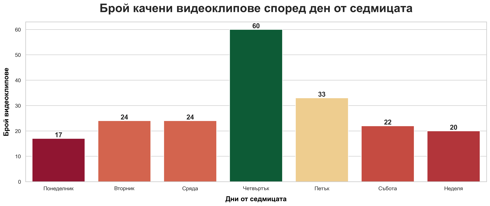
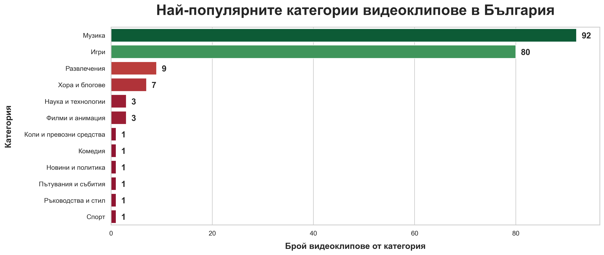
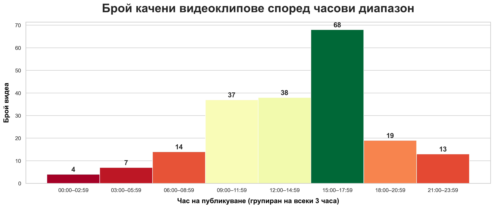

# Анализ на най-популярните YouTube видеа за България

## Какво прави проектът

Извлича най-популярните видеа чрез YouTube Data API.

Отговаря на въпросите:
1. Кои са най-популярните категории видеоклипове в България?
2. Кой е най-популярният видеоклип от всяка от категориите?
3. Кога най-често се качват най-гледаните видеа (ден, час)?

Представя ясни визуализации за всеки от въпросите.

Визуализация за най-популярните категории:

Визуализация за най-често качвани видеоклипове по дни от седмицата:

Визуализация за най-често качвани видеоклипове по часове от деня:

